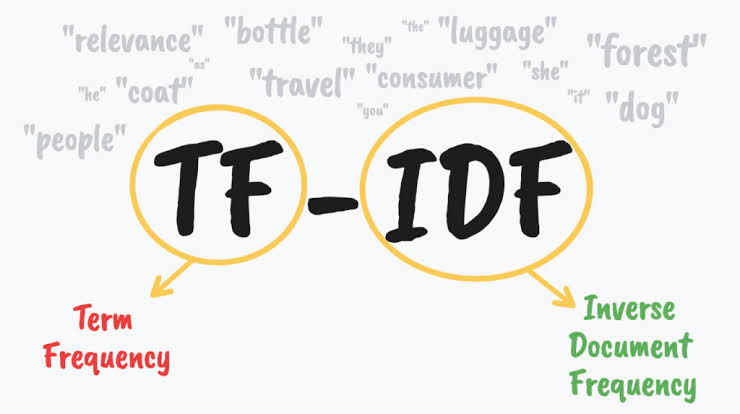

# Q1 — TF and IDF, and why studying them separately can mislead you

## Term Frequency (TF)

TF measures how often a word shows up inside *one* document, relative to that document's length:

$$
\text{TF}(t, d) = \frac{\text{number of times term } t \text{ appears in document } d}{\text{total number of terms in } d}
$$

The intuition is simple: if a word keeps repeating inside a document, it's probably central to what that document is about.

## Inverse Document Frequency (IDF)

IDF looks at the *whole corpus* instead of a single document, and asks how rare a word is across all documents:

$$
\text{IDF}(t) = \log\left(\frac{N}{\text{df}(t)}\right)
$$

where $N$ is the total number of documents and $\text{df}(t)$ is the number of documents that contain $t$ at least once. Words that show up almost everywhere — "the," "is," "said," "yesterday" — get an IDF close to zero, because appearing in every document means they don't help you tell documents apart. A word that appears in only a handful of documents out of thousands gets a large IDF, because its presence is a strong signal about what that document is specifically about.

## TF-IDF: combining the two

TF-IDF is simply the product of the two statistics above:

$$
\text{TF-IDF}(t, d) = \text{TF}(t, d) \times \text{IDF}(t)
$$

A term gets a high TF-IDF score only when it satisfies *both* conditions at once: it must appear often in the document being scored (high TF), and it must be rare across the rest of the corpus (high IDF). Missing either condition drags the score down.

### Worked example

Say our corpus has $N = 4$ documents, and we're scoring document $d_1$, which is 100 words long.

**Term "the"** (a stopword): it appears 8 times in $d_1$, and it also appears in all 4 documents in the corpus.

$$
\text{TF}(\text{the}, d_1) = \frac{8}{100} = 0.08
$$

$$
\text{IDF}(\text{the}) = \log\left(\frac{4}{4}\right) = \log(1) = 0
$$

$$
\text{TF-IDF}(\text{the}, d_1) = 0.08 \times 0 = 0
$$

**Term "election"**: it appears only 3 times in $d_1$, but across the corpus it only shows up in 2 of the 4 documents.

$$
\text{TF}(\text{election}, d_1) = \frac{3}{100} = 0.03
$$

$$
\text{IDF}(\text{election}) = \log\left(\frac{4}{2}\right) = \log(2) \approx 0.301
$$

$$
\text{TF-IDF}(\text{election}, d_1) = 0.03 \times 0.301 \approx 0.009
$$

Even though "the" appears more than twice as often as "election" in $d_1$ (8 times vs. 3), its TF-IDF score collapses to exactly $0$, while "election" ends up with a positive score. Raw frequency alone (TF) would have ranked "the" as the more important word — TF-IDF correctly flips that ranking, because "the" carries no distinguishing power across the corpus.

## Why they can't be used in isolation — they have to come together

The two statistics are answering two different questions, and each one has a blind spot the other one exists to fix.

If you only look at TF, the words with the highest scores in almost every document will be stopwords — "the," "and," "a" — simply because they're repeated constantly in normal language, regardless of topic. High TF does not mean the word is meaningful; it might just mean the word is common in the language itself. That's exactly what the worked example above shows: "the" wins on TF alone.

If you only look at IDF, you get the opposite problem. A rare word gets rewarded purely for being rare, even if it barely appears in the specific document you're analyzing, or even if it's a typo, a proper noun that shows up once by coincidence, or noise. Rarity across the corpus tells you nothing about whether the word actually matters *within* a given document — a word could have a huge IDF and still be irrelevant to a particular document if it only appears there once, in passing.

The picture above captures this well: TF and IDF are drawn as two separate lenses of one pair of glasses. Looking through only the red lens (TF) or only the green lens (IDF) doesn't bring anything into focus — words like "he," "she," "it," "the," and "they" stay faded in the background no matter which single lens you use, because TF alone can't tell they're stopwords and IDF alone can't tell whether they're relevant to a specific document. It's only when both lenses are combined — TF *and* IDF worn together — that the meaningful, topic-specific words ("relevance," "consumer," "forest," "travel") come into sharp focus while the generic background words stay blurred out.

This is exactly why TF and IDF are almost always multiplied together rather than reported separately. Studying TF alone rewards frequency without distinctiveness, and studying IDF alone rewards rarity without relevance; only together do they cancel out each other's weaknesses and produce a score that tracks real topical importance.
