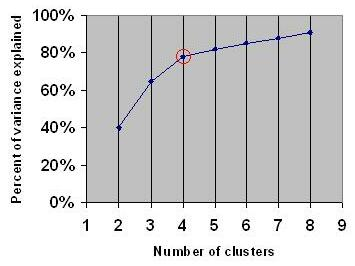

# Q2 — The Elbow Point method for choosing the rank in Truncated SVD

## What we want to do

When we compute the SVD of a matrix $A_{d\times n} = U\Sigma V^T$, the diagonal of $\Sigma$ holds the singular values $\sigma_1 \ge \sigma_2 \ge \dots \ge \sigma_r \ge 0$, sorted from largest to smallest. Each singular value tells us how much structure of the matrix is kept in its matching pair of vectors. The first singular value is the strongest and most important pattern in the data. The last ones are the weakest and least important.

Truncated SVD keeps only the first $k$ singular values (and their matching vectors), and drops the rest. This gives us a rank-$k$ approximation:

$$
A_k = U_k \Sigma_k V_k^T
$$

So the real question is simple: **how do we choose $k$?** We want a $k$ that is small — so the approximation is cheap and easy to store — but still keeps almost all the useful information in $A$. The elbow point method is one simple way to choose this $k$.

## Why we need a method to choose $k$

If $k$ is too small, we lose real structure, and the approximation becomes a poor summary of the original matrix. If $k$ is too large, we keep singular values that add almost nothing useful — we just carry extra noise for no real benefit. We want to find the point between these two: keep everything important, and drop everything that is not.

## The idea behind the elbow point

If we plot the singular values on the y-axis, against their rank index $i = 1, 2, 3, \dots$ on the x-axis, the curve almost always looks the same for real data: it drops fast for the first few values, then the drop becomes slower, and the curve becomes almost flat for a long tail.

That bend — where the curve stops dropping fast and starts to flatten — is called the "elbow" (or the "knee"). It looks like the inside of a bent arm, which is where the name comes from.

The idea is simple: the singular values *before* the elbow are large and clearly different from each other. They show real, important structure in the data — this is the "signal." The singular values *after* the elbow are small, close to each other, and drop slowly. This is the sign of noise, or small details that do not matter much. So we choose $k$ to be the index at the elbow: we keep everything that looks like signal, and drop everything that looks like noise.

We see the same idea in other places too, like choosing the number of clusters $k$ in k-means clustering. There, instead of singular values, we plot how much variance is explained as we add more clusters. The shape of the curve is a little different, but the logic for choosing the bend point is the same:

*Source: [Elbow method (clustering) — Wikipedia](https://en.wikipedia.org/wiki/Elbow_method_(clustering))*

In this picture, going from 2 to 3 to 4 clusters explains a lot more variance each time. But after $k = 4$ (circled in red), each extra cluster adds almost nothing. That circled point is the elbow — after it, we pay for more complexity but get almost nothing back. Choosing $k$ for singular values works the same way: look for the point where the curve stops dropping fast and becomes flat.

## Why this is a good tradeoff

Cutting at the elbow gives us a rank $k$ that is usually much smaller than the true rank $r$ of the matrix, but it still keeps most of the matrix's information. This works because the singular values we drop are small, and (as we will see in Q3) the reconstruction error depends directly on the size of the singular values we drop. So the elbow point is close to the point where adding more dimensions stops being worth it: past this point, we use more dimensions but gain very little extra information.

In practice, we do this visually: plot the singular values, look for where the curve bends, and pick that index as $k$. This is a heuristic, not an exact rule — the bend is not always sharp. But it is fast, simple, and it works well when singular values drop quickly, which is common for text data, like the term-document matrices used in LSI.
