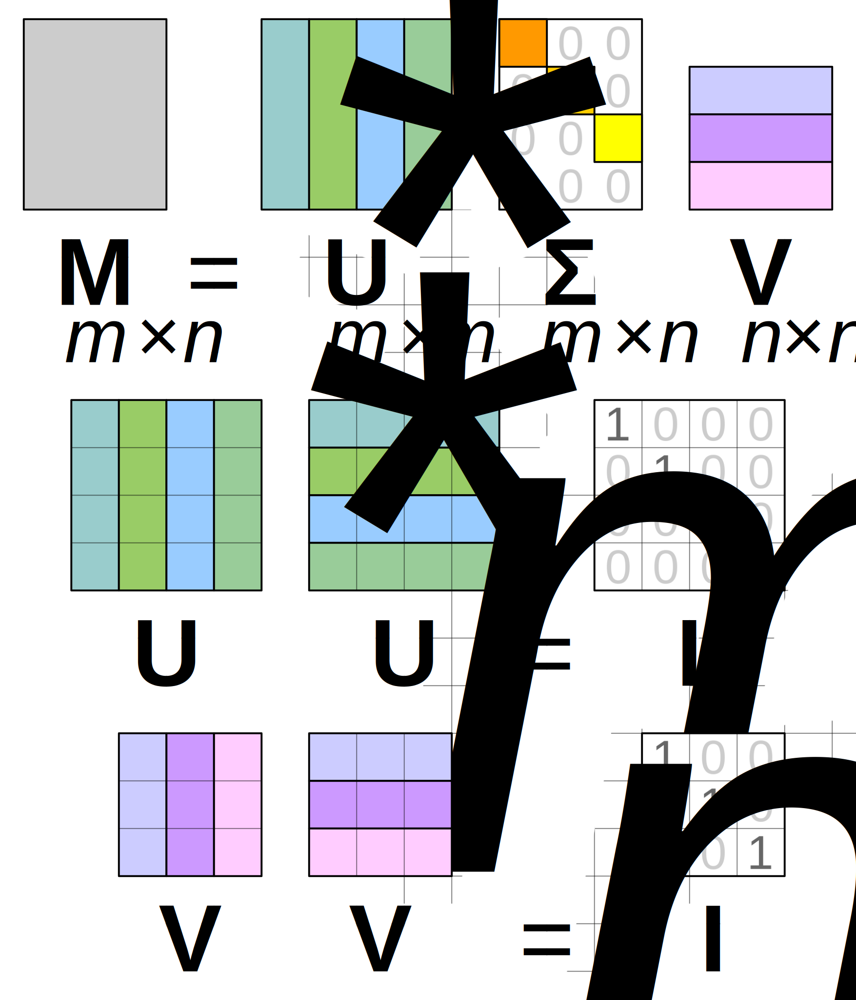

# Q3 — Computing the reconstruction error of Truncated SVD

## What we want to do

Once we cut the SVD down to rank $k$, we want to know how much information we actually lost. The reconstruction error measures this — it is the gap between the original matrix $A$ and the approximation $A_k$ we built from it. This tells us if our choice of $k$ (for example, from the elbow method in Q2) was good enough.

## Setup

Let $A_{d\times n}$ be the original matrix, with full SVD:

$$
A = U \Sigma V^T, \qquad \Sigma = \text{diag}(\sigma_1, \sigma_2, \dots, \sigma_r), \quad \sigma_1 \ge \sigma_2 \ge \dots \ge \sigma_r \ge 0
$$

Here $r$ is the rank of $A$. The rank-$k$ truncated approximation is:

$$
A_k = U_k \Sigma_k V_k^T
$$

built from only the top $k$ singular values and their matching vectors.

*Source: [Singular value decomposition — Wikipedia](https://en.wikipedia.org/wiki/Singular_value_decomposition), diagram by CMG Lee*

The picture shows the full decomposition of a matrix $M$ into $U$, $\Sigma$, and $V^*$. Truncated SVD keeps only the first $k$ columns of $U$, the first $k$ singular values in $\Sigma$, and the first $k$ rows of $V^*$ — the rest gets cut off. The reconstruction error tells us how much we lose by cutting there.

## The error itself

A natural way to measure "how different are these two matrices" is the Frobenius norm of their difference:

$$
\|A - A_k\|_F = \sqrt{\sum_{i,j} \left(A_{ij} - (A_k)_{ij}\right)^2}
$$

We do not actually need to subtract the two matrices entry by entry to get this number. Because of how SVD is built, it turns out that:

$$
\|A - A_k\|_F = \sqrt{\sum_{i=k+1}^{r} \sigma_i^2}
$$

In words: the reconstruction error is just the size of the singular values we threw away. This comes from the Eckart–Young theorem, which also tells us something useful — $A_k$ is not just *a* rank-$k$ approximation, it is the *best possible* rank-$k$ approximation of $A$, using this norm. No other rank-$k$ matrix can get closer to $A$ than the truncated SVD does.

This is also why the elbow-point idea from Q2 works: the singular values we cut after the elbow are small, so $\sum_{i=k+1}^{r}\sigma_i^2$ stays small. This means the reconstruction error stays small too, even though we threw away most of the dimensions.

## Relative error

In practice, it is often more useful to report a *relative* reconstruction error, instead of the raw Frobenius norm, because the raw number depends on the scale of the data:

$$
\text{relative error} = \frac{\|A - A_k\|_F}{\|A\|_F} = \sqrt{\frac{\sum_{i=k+1}^{r}\sigma_i^2}{\sum_{i=1}^{r}\sigma_i^2}}
$$

This gives us a number between 0 and 1 (0% to 100%), and we can use it directly to choose $k$. For example: "keep enough singular values so the relative reconstruction error stays under 5%."
